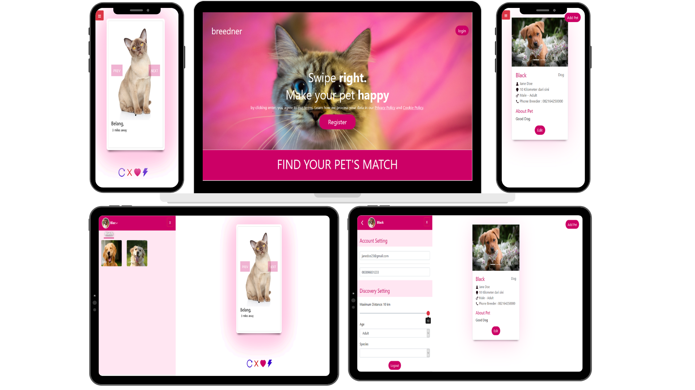

## Breednder

Breednder is tinder likes social media for "Breeder" to find their best pets partner.

## Table of Contents

- [Getting Started](#getting-started)
  - [Prerequisites](#prerequisites)
  - [Installation](#installation)
  - [Server Setup](#server-setup)
  - [Client Setup](#client-setup)
- [Screenshots](#screenshots)
- [Built With](#built-with)
- [Author](#author)
- [License](#license)

## Getting Started

Before starting to install the project, there're some things that need to be done first.

Make sure all of these are properly installed in your system.
| Application | Download |
| ------------ | ----------------------------------------------------------------------------------- |
| Git | [Windows](https://gitforwindows.org/) / [Linux](https://git-scm.com/download/linux) |
| Node.js | [Link](https://nodejs.org/en/download/) |
| React Js | [Link](https://facebook.github.io/react-native/docs/getting-started) |
| MySQL | [Link](https://www.mysql.com/downloads/) |

### Installation

First, clone this repository into your system.

```
git clone https://github.com/mahesarohman98/breednder_mahesarohman_dw14perhi.git
```

Then, install all the packages that described in `package.json` of both `client` and `server` directories.

```
npm install
```

### Server Setup

For the server setup, first, make sure your MySQL services is running fine. In `server` directory, you'll find `config.json` inside `config` folder. Open and edit the `development` configuration to match your database setup.

```
  "development": {
    "username": "root",
    "password": null,
    "database": "database_development",
    "host": "127.0.0.1",
    "dialect": "mysql",
    "operatorsAliases": false
  },
```

After completing the database configuration setup, migrate all the required tables.

```
npm run build
```

We also need to configure some environtment variables for the server, let's create `.env` file in server's root project, open and edit it, then input the code below.

```
SECRET_KEY=ThisIsTheSecretKey
BASE_URL=http://192.168.1.1:3000/
```

For the `SECRET_KEY` you can custom it as you wish. But, for `BASE_URL` make sure it is matched to your local network Internet Protocol.

And for the last step, running the server

```
npm start
```

### Client Setup

For the client setup, this project was bootstrapped with [Create React App](https://github.com/facebook/create-react-app).

Before running the application, we need to configure an environtment variable for the client, let's create `.env` file in client's root project, open and edit it, then input the code below.

```
BASE_URL=http://192.168.1.1:5000/api/v1
```

Note that the variable `BASE_URL` above is your server network Internet Protocol. If you are using physical device, make sure your physical device and server computer have a same network connection.

Then, install and run the application.

npm start

Wait till the application is installed and run into your device. Now, you can explore Breeder and its features. Enjoy!

## Screenshots



## Built With

- [React](https://reactjs.org/) - Front-end
- [Express JS](https://expressjs.com) - Back-end
- [MySQL](https://www.mysql.com) - Database

## Author

**Mahesa Rohman** - [mahesarohman98](https://github.com/mahesarohman98)
